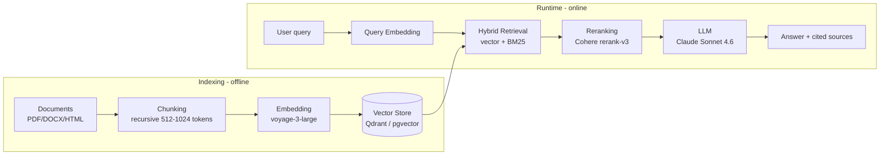

# Skill — RAG Architecture (Retrieval-Augmented Generation)
> Certifications: AWS MLS-C01 · Google Professional ML Engineer · DeepLearning.AI RAG

## Objective
Design and optimize a RAG pipeline to ground LLM answers in reliable data.

## Standard RAG pipeline



## Detailed steps

### 1. Ingestion
- Supported formats: PDF, DOCX, HTML, Markdown, JSON, CSV
- Extraction: LlamaParse, Unstructured, PDFPlumber
- Cleaning: remove headers/footers, normalization

### 2. Chunking
| Strategy | Size | Ideal for |
|---|---|---|
| Fixed size | 512-1024 tokens | Homogeneous documents |
| Recursive | Variable | Structured text |
| Semantic | Variable | Maximum precision |
| Parent-child | Hierarchical | Rich context + precision |

### 3. Embedding (2026)
- **Voyage AI** voyage-3-large (1024 dim) — Anthropic partner, MTEB 2025 benchmark leader
- **OpenAI** text-embedding-3-large (3072 dim) — quality, pricier
- **Cohere** embed-multilingual-v3 — excellent multilingual
- **HuggingFace** bge-m3 — open source, multilingual, self-hosted

### Recursive chunking code (Python reference)

```python
from langchain_text_splitters import RecursiveCharacterTextSplitter
from langchain_voyageai import VoyageAIEmbeddings
from langchain_qdrant import QdrantVectorStore

# Separator hierarchy: try to split at \n\n, then \n, then sentences, then words
splitter = RecursiveCharacterTextSplitter(
    chunk_size=1000,            # ~750 tokens, retrieval sweet spot
    chunk_overlap=200,           # 20% overlap → semantic continuity
    separators=["\n\n", "\n", ". ", " ", ""],
    length_function=len,
)
chunks = splitter.split_documents(docs)

# Metadata propagated automatically to the chunks (source, page, section)
for chunk in chunks:
    chunk.metadata["chunk_id"] = f"{chunk.metadata['source']}-{chunk.metadata.get('page', 0)}"

embeddings = VoyageAIEmbeddings(model="voyage-3-large")
vs = QdrantVectorStore.from_documents(chunks, embeddings, url="http://localhost:6333")
```

### 4. Vector Store
- pgvector (PostgreSQL) · Qdrant · Pinecone · Weaviate

### 5. Retrieval
- **Similarity search**: basic cosine similarity
- **Hybrid search**: vector + BM25 (keyword) → better precision
- **MMR** (Maximal Marginal Relevance): result diversity

### 6. Reranking (optional but recommended)
- Cohere Rerank · CrossEncoder (HuggingFace)
- Improves precision by 10-30%

### Advanced RAG patterns
- **HyDE** (Hypothetical Document Embeddings): generate a hypothetical doc before embedding the query
- **RAG Fusion**: multi-query + result fusion
- **Self-RAG**: the agent decides whether it needs retrieval
- **CRAG** (Corrective RAG): relevance assessment of the retrieved chunks

## RAG quality metrics
Context Precision · Context Recall · Faithfulness · Answer Relevance (via RAGAs)

## Deliverables
- RAG pipeline diagram
- Justified choices (chunking, embedding, vector DB, reranking)
- RAGAs report (quality metrics)
- Optimization recommendations

## Output format
Specify: document type · volume (# docs, avg size) · language · latency constraints · target LLM
