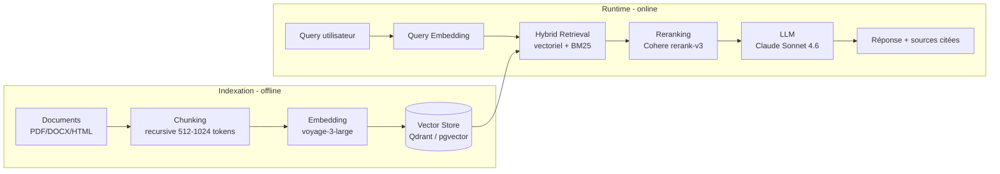

# Skill — Architecture RAG (Retrieval-Augmented Generation)
> Certifications : AWS MLS-C01 · Google Professional ML Engineer · DeepLearning.AI RAG

## Objectif
Concevoir et optimiser un pipeline RAG pour ancrer les réponses LLM dans des données fiables.

## Pipeline RAG standard



## Étapes détaillées

### 1. Ingestion
- Formats supportés : PDF, DOCX, HTML, Markdown, JSON, CSV
- Extraction : LlamaParse, Unstructured, PDFPlumber
- Nettoyage : suppression headers/footers, normalisation

### 2. Chunking (découpage)
| Stratégie | Taille | Idéal pour |
|---|---|---|
| Fixed size | 512-1024 tokens | Documents homogènes |
| Recursive | Variable | Texte structuré |
| Semantic | Variable | Précision maximale |
| Parent-child | Hiérarchique | Context riche + précision |

### 3. Embedding (2026)
- **Voyage AI** voyage-3-large (1024 dim) — partenaire Anthropic, leader benchmark MTEB 2025
- **OpenAI** text-embedding-3-large (3072 dim) — qualité, plus cher
- **Cohere** embed-multilingual-v3 — multilingue excellent
- **HuggingFace** bge-m3 — open source, multilingue, self-hosted

### Code de chunking récursif (référence Python)

```python
from langchain_text_splitters import RecursiveCharacterTextSplitter
from langchain_voyageai import VoyageAIEmbeddings
from langchain_qdrant import QdrantVectorStore

# Hiérarchie de séparateurs : on tente de couper à \n\n, puis \n, puis phrases, puis mots
splitter = RecursiveCharacterTextSplitter(
    chunk_size=1000,            # ~750 tokens, sweet spot retrieval
    chunk_overlap=200,           # 20% de chevauchement → continuité sémantique
    separators=["\n\n", "\n", ". ", " ", ""],
    length_function=len,
)
chunks = splitter.split_documents(docs)

# Métadonnées propagées automatiquement aux chunks (source, page, section)
for chunk in chunks:
    chunk.metadata["chunk_id"] = f"{chunk.metadata['source']}-{chunk.metadata.get('page', 0)}"

embeddings = VoyageAIEmbeddings(model="voyage-3-large")
vs = QdrantVectorStore.from_documents(chunks, embeddings, url="http://localhost:6333")
```

### 4. Vector Store
- pgvector (PostgreSQL) · Qdrant · Pinecone · Weaviate

### 5. Retrieval
- **Similarity search** : cosine similarity de base
- **Hybrid search** : vectoriel + BM25 (keyword) → meilleure précision
- **MMR** (Maximal Marginal Relevance) : diversité des résultats

### 6. Reranking (optionnel mais recommandé)
- Cohere Rerank · CrossEncoder (HuggingFace)
- Améliore la précision de 10-30%

### Advanced RAG patterns
- **HyDE** (Hypothetical Document Embeddings) : générer un doc hypothétique avant d'embedder la query
- **RAG Fusion** : multi-query + fusion des résultats
- **Self-RAG** : l'agent décide s'il a besoin de retrieval
- **CRAG** (Corrective RAG) : évaluation de la pertinence des chunks récupérés

## Métriques de qualité RAG
Context Precision · Context Recall · Faithfulness · Answer Relevance (via RAGAs)

## Livrables
- Diagramme du pipeline RAG
- Choix justifiés (chunking, embedding, vector DB, reranking)
- Rapport RAGAs (métriques de qualité)
- Recommandations d'optimisation

## Format de sortie
Précise : type de documents · volume (nb docs, taille moy.) · langue · contraintes latence · LLM cible
