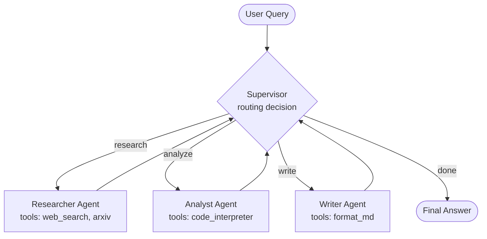

# Skill — Agentic System Design Patterns
> Certifications: AWS MLS-C01 · Google Professional ML Engineer

## Objective
Design the architecture of an AI agent system by choosing the right patterns for the use case.

## Fundamental patterns (2026)

### 1. ReAct (Reasoning + Acting)
- The agent reasons (Thought) → acts (Action) → observes (Observation) → loops
- Ideal for: sequential tasks with external tools

### 2. Routing
- An orchestrator agent dispatches to the specialized agent based on the request
- Ideal for: multi-domain systems, complex chatbots

### 3. Parallelism
- Several agents run tasks simultaneously
- Ideal for: multi-source analysis, multi-variant generation

### 4. Reflection
- An agent critiques and improves its own output
- Ideal for: code generation, writing, quality review

### 5. Plan & Execute
- Phase 1: planning (problem decomposition)
- Phase 2: step-by-step plan execution
- Ideal for: long, complex tasks

### 6. Multi-Agent Supervisor
- A supervisor agent coordinates specialized sub-agents
- Ideal for: complex workflows (research + analysis + writing)

## Pattern selection criteria
| Criterion | Recommended pattern |
|---|---|
| Simple sequential task | ReAct |
| Multiple domains | Routing |
| Speed / parallelization | Parallelism |
| Critical quality | Reflection |
| Long decomposable task | Plan & Execute |
| Team of specialized agents | Multi-Agent Supervisor |

## Example: Multi-Agent Supervisor with LangGraph

### Diagram (Mermaid)



### Implementation (Python — LangGraph 0.2+)

```python
from typing import Literal, Annotated
from typing_extensions import TypedDict
from langgraph.graph import StateGraph, END, START
from langgraph.types import Command
from langchain_anthropic import ChatAnthropic

class State(TypedDict):
    messages: list
    next: str  # name of the next agent or "FINISH"

llm = ChatAnthropic(model="claude-opus-4-8")
MEMBERS = ["researcher", "analyst", "writer"]

def supervisor_node(state: State) -> Command[Literal[*MEMBERS, "FINISH"]]:
    """Decide which agent to call next, or FINISH."""
    system = f"You coordinate {MEMBERS}. Choose the next one or FINISH."
    response = llm.with_structured_output({
        "type": "object",
        "properties": {"next": {"enum": MEMBERS + ["FINISH"]}}
    }).invoke([{"role": "system", "content": system}] + state["messages"])
    goto = response["next"]
    if goto == "FINISH":
        return Command(goto=END)
    return Command(goto=goto, update={"next": goto})

def researcher_node(state: State) -> Command[Literal["supervisor"]]:
    # ... call the researcher with its web_search, arxiv tools
    result = llm.invoke(state["messages"] + [{"role": "system", "content": "You are Researcher."}])
    return Command(goto="supervisor", update={"messages": [result]})

# Same for analyst_node and writer_node...

graph = StateGraph(State)
graph.add_node("supervisor", supervisor_node)
graph.add_node("researcher", researcher_node)
graph.add_node("analyst", analyst_node)
graph.add_node("writer", writer_node)
graph.add_edge(START, "supervisor")
app = graph.compile()

result = app.invoke({"messages": [{"role": "user", "content": "Analyze the impact of the AI Act on healthcare"}]})
```

## Deliverables
- Architecture diagram (Mermaid) + annotated control flow
- Starter code for the chosen pattern (LangGraph / CrewAI / Anthropic SDK)
- Justified pattern choice (latency × cost × quality trade-offs)
- List of tools and agents with input/output contracts

## Output format
Specify: use case · constraints (latency, cost, quality) · available LLM · target framework (LangGraph, CrewAI, AutoGen, native Anthropic SDK)
