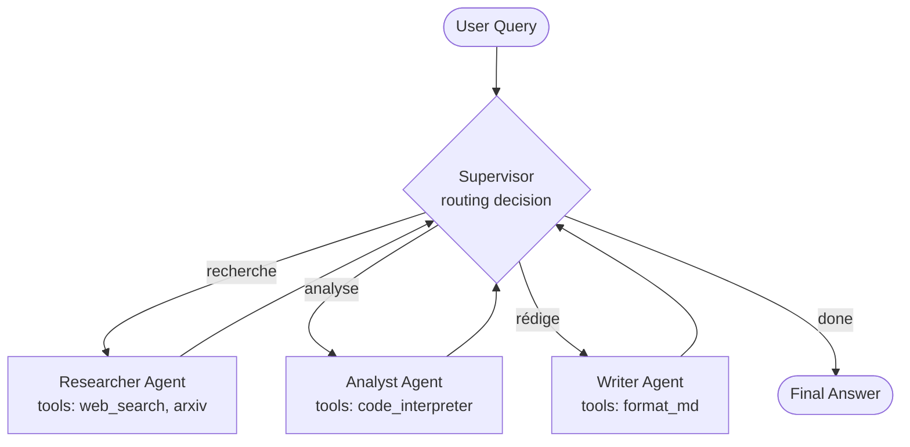

# Skill — Design Patterns d'un Système Agentique
> Certifications : AWS MLS-C01 · Google Professional ML Engineer

## Objectif
Concevoir l'architecture d'un système d'agents IA en choisissant les bons patterns selon le cas d'usage.

## Patterns fondamentaux (2026)

### 1. ReAct (Reasoning + Acting)
- L'agent raisonne (Thought) → agit (Action) → observe (Observation) → boucle
- Idéal pour : tâches séquentielles avec outils externes

### 2. Routing
- Un agent orchestrateur dirige vers l'agent spécialisé selon la requête
- Idéal pour : systèmes multi-domaines, chatbots complexes

### 3. Parallelism
- Plusieurs agents exécutent des tâches simultanément
- Idéal pour : analyse multi-sources, génération multi-variantes

### 4. Reflection
- Un agent critique et améliore son propre output
- Idéal pour : génération de code, rédaction, révision qualité

### 5. Plan & Execute
- Phase 1 : planification (décomposition du problème)
- Phase 2 : exécution pas à pas du plan
- Idéal pour : tâches longues et complexes

### 6. Multi-Agent Supervisor
- Un agent superviseur coordonne des sous-agents spécialisés
- Idéal pour : workflows complexes (recherche + analyse + rédaction)

## Critères de choix du pattern
| Critère | Pattern recommandé |
|---|---|
| Tâche séquentielle simple | ReAct |
| Domaines multiples | Routing |
| Rapidité / parallélisation | Parallelism |
| Qualité critique | Reflection |
| Tâche longue décomposable | Plan & Execute |
| Équipe d'agents spécialisés | Multi-Agent Supervisor |

## Exemple : Multi-Agent Supervisor avec LangGraph

### Diagramme (Mermaid)



### Implémentation (Python — LangGraph 0.2+)

```python
from typing import Literal, Annotated
from typing_extensions import TypedDict
from langgraph.graph import StateGraph, END, START
from langgraph.types import Command
from langchain_anthropic import ChatAnthropic

class State(TypedDict):
    messages: list
    next: str  # nom de l'agent suivant ou "FINISH"

llm = ChatAnthropic(model="claude-sonnet-4-6")
MEMBERS = ["researcher", "analyst", "writer"]

def supervisor_node(state: State) -> Command[Literal[*MEMBERS, "FINISH"]]:
    """Décide quel agent appeler ensuite, ou FINISH."""
    system = f"Tu coordonnes {MEMBERS}. Choisis le prochain ou FINISH."
    response = llm.with_structured_output({
        "type": "object",
        "properties": {"next": {"enum": MEMBERS + ["FINISH"]}}
    }).invoke([{"role": "system", "content": system}] + state["messages"])
    goto = response["next"]
    if goto == "FINISH":
        return Command(goto=END)
    return Command(goto=goto, update={"next": goto})

def researcher_node(state: State) -> Command[Literal["supervisor"]]:
    # ... appel au researcher avec ses tools web_search, arxiv
    result = llm.invoke(state["messages"] + [{"role": "system", "content": "Tu es Researcher."}])
    return Command(goto="supervisor", update={"messages": [result]})

# Idem pour analyst_node et writer_node...

graph = StateGraph(State)
graph.add_node("supervisor", supervisor_node)
graph.add_node("researcher", researcher_node)
graph.add_node("analyst", analyst_node)
graph.add_node("writer", writer_node)
graph.add_edge(START, "supervisor")
app = graph.compile()

result = app.invoke({"messages": [{"role": "user", "content": "Analyse l'impact de l'AI Act sur la santé"}]})
```

## Livrables
- Diagramme d'architecture (Mermaid) + flux de contrôle annoté
- Code d'amorce du pattern choisi (LangGraph / CrewAI / Anthropic SDK)
- Choix de pattern justifié (trade-offs latence × coût × qualité)
- Liste des tools et agents avec contrats input/output

## Format de sortie
Précise : cas d'usage · contraintes (latence, coût, qualité) · LLM disponible · framework cible (LangGraph, CrewAI, AutoGen, SDK Anthropic natif)
