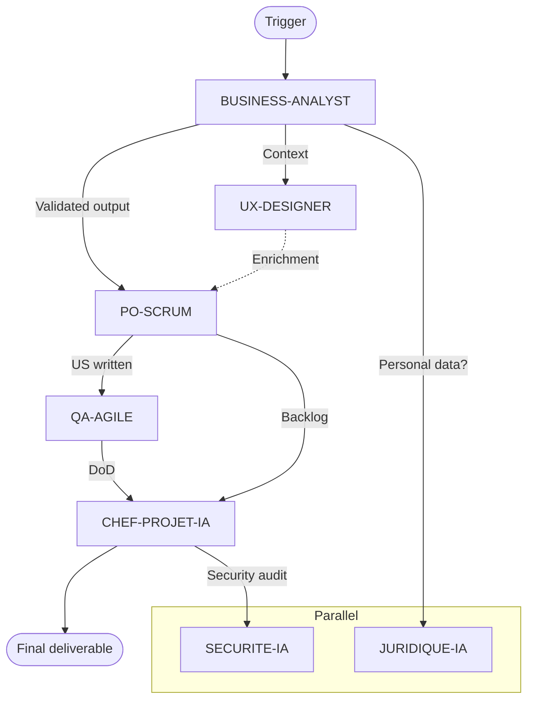

# Skill — Dependency Mapping and Sequencing
> Certifications: BPMN 2.0 OCM (OMG), PMP (PMI), SAFe 6 Agilist (Scaled Agile), PRINCE2 Practitioner (Axelos)

## Objective
Identify and formalize every dependency between the agents of a workflow — which steps must be completed before others, which can be parallelized — to build an optimal sequence.

## Dependency types

```
TYPE 1 — HARD DEPENDENCY (blocking)
  Agent B CANNOT start without the validated output of agent A
  Symbol: A ══► B
  Example: BUSINESS-ANALYST must deliver before PO-SCRUM writes the US

TYPE 2 — SOFT DEPENDENCY (enriching)
  Agent B CAN start, but its output will be better with A's output
  Symbol: A ──► B
  Example: UX-DESIGNER enriches PO-SCRUM's US, but can work in parallel

TYPE 3 — PARALLEL DEPENDENCY (independent)
  Agents A and B are independent and can run simultaneously
  Symbol: A │││ B
  Example: QA-AGILE and SECURITE-IA work in parallel on distinct scopes

TYPE 4 — CONDITIONAL DEPENDENCY (gateway)
  Agent B is triggered only if a condition is met
  Symbol: A ──<?>──► B or C
  Example: If UX needed → UX-DESIGNER, otherwise → QA-AGILE directly
```

---

## Dependency matrix — Template

```
WORKFLOW : [NAME]
DATE : [DATE]

         | BA | PO-S | PO-SF | SM | QA-A | UX | CPJ | CA | SEC |
─────────────────────────────────────────────────────────────────
BA       |  — |  ══► |  ══►  | ── |  ──  | ── | ──► | ── |  ─  |
PO-SCRUM |    |  —   |  ──   | ── |  ══► | ── | ──► | ── |  ─  |
PO-SAFE  |    |      |  —    | ── |  ══► | ── | ══► | ── |  ─  |
SM       |    |      |       | —  |  ──  | ── | ──► | ── |  ─  |
QA-AGILE |    |      |       |    |  —   | ── | ──► | ── |  ─  |
UX-DESIGN|    |      |       |    |  ──  | —  | ──  | ── |  ─  |
CHEF-PRJ |    |      |       |    |  ─   | ─  | —   | ── |  ─  |
CONSULT  |    |      |       |    |  ─   | ─  | ──  | —  |  ─  |
SECURITE |    |      |       |    |  ──  | ─  | ──► | ─  |  —  |

LEGEND : ══► Hard / ──► Soft / ─ None
```

---

## Dependency graph — mermaid format



---

## YAML template — Execution sequence

```yaml
workflow:
  id: "WF-001"
  name: "AI Product Scoping"
  
  sequence:
    - id: 1
      agent: "BUSINESS-ANALYST"
      type: "sequential"
      depends_on: []
      prerequisite: "Client brief available"
      output: "Needs map + stakeholders + scope"
      
    - id: 2a
      agent: "PO-SCRUM"
      type: "sequential"
      depends_on: [1]
      prerequisite: "STEP-1 output validated"
      output: "User Stories + acceptance criteria"
      
    - id: 2b
      agent: "UX-DESIGNER"
      type: "parallel_with: 2a"
      depends_on: [1]
      prerequisite: "STEP-1 output available (non-blocking)"
      output: "Wireframes + user journey"
      
    - id: 3
      agent: "QA-AGILE"
      type: "sequential"
      depends_on: [2a]
      prerequisite: "US validated by the user"
      output: "DoR / DoD + test plan"
      
    - id: 4
      agent: "CHEF-PROJET-IA"
      type: "sequential"
      depends_on: [2a, 2b, 3]
      prerequisite: "All outputs 2a, 2b, 3 available"
      output: "Executive-committee reporting + schedule"
```

---

## Sequencing rules

1. **Always identify the scoping agent first** (BUSINESS-ANALYST or CONSULTANT-IA)
2. **Never start development before architecture** (AI-ARCHITECT → DEV)
3. **Never start testing without validated US** (PO-SCRUM → QA-AGILE)
4. **JURIDIQUE-IA and SECURITE-IA can always run in parallel** on any step
5. **CHEF-PROJET-IA always consolidates at the end of the chain** for reporting
6. **REDACTEUR-IA is always the last step** if a written deliverable is expected

## Deliverables
- Complete dependency matrix
- mermaid graph of the workflow
- Documented YAML sequence
- Bottleneck identification

## Output format
Specify: the agents involved, the workflow type (scoping / delivery / consulting), deadline constraints, expected deliverables per step.

## Anti-patterns
- ❌ **Circular dependencies** (non-acyclic graph): deadlock → guarantee a DAG
- ❌ **Everything sequential by default**: parallelizable steps are missed → identify independent branches (see `parallel-orchestration.md`)
- ❌ **Implicit undocumented dependency**: fragile order → explicit dependency matrix
- ❌ **No critical-path identification**: optimizing the wrong step → mark the critical path
- ❌ **Undetected bottlenecks**: one agent blocks the whole chain → bottleneck analysis

## Sources
- **BPMN 2.0.2** — OMG (2013): fork/join, sequence — omg.org/spec/BPMN
- **PMBOK 7** (PMI, 2021) — dependencies (FS/SS/FF/SF), critical path (CPM) · **directed acyclic graph (DAG)** theory

## See also
- [`workflow-design.md`](workflow-design.md) — overall sequencing
- [`parallel-orchestration.md`](parallel-orchestration.md) — execution of independent branches
- [`agent-routing.md`](agent-routing.md) — agent selection per step
- [`trigger-management.md`](trigger-management.md) — pass conditions between steps
