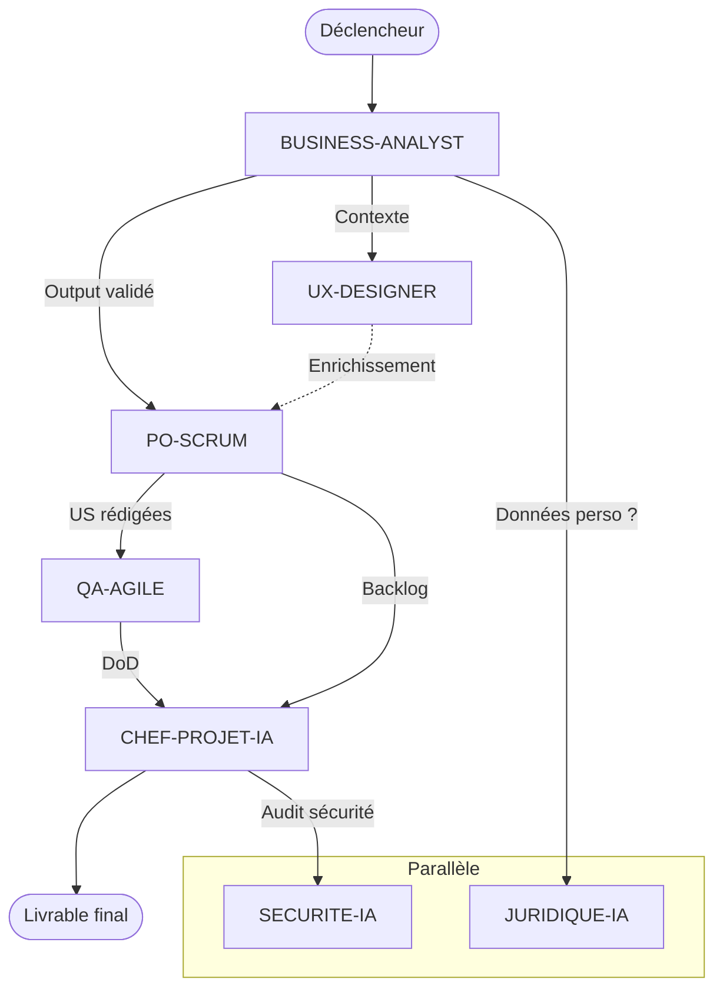

# Skill — Cartographie des Dépendances et Séquencement
> Certifications : BPMN 2.0 OCM (OMG), PMP (PMI), SAFe 6 Agilist (Scaled Agile), PRINCE2 Practitioner (Axelos)

## Objectif
Identifier et formaliser toutes les dépendances entre les agents d'un workflow — quelles étapes doivent être complétées avant d'autres, lesquelles peuvent être parallélisées — pour construire un séquençage optimal.

## Types de dépendances

```
TYPE 1 — DÉPENDANCE FORTE (bloquante)
  L'agent B NE PEUT PAS démarrer sans l'output validé de l'agent A
  Symbole : A ══► B
  Exemple : BUSINESS-ANALYST doit livrer avant que PO-SCRUM rédigit les US

TYPE 2 — DÉPENDANCE SOUPLE (enrichissante)
  L'agent B PEUT démarrer, mais son output sera meilleur avec l'output de A
  Symbole : A ──► B
  Exemple : UX-DESIGNER enrichit les US du PO-SCRUM, mais peut travailler en parallèle

TYPE 3 — DÉPENDANCE PARALLÈLE (indépendante)
  Les agents A et B sont indépendants et peuvent s'exécuter simultanément
  Symbole : A │││ B
  Exemple : QA-AGILE et SECURITE-IA travaillent en parallèle sur des périmètres distincts

TYPE 4 — DÉPENDANCE CONDITIONNELLE (gateway)
  L'agent B est déclenché uniquement si une condition est remplie
  Symbole : A ──<?>──► B ou C
  Exemple : Si besoin UX → UX-DESIGNER, sinon → QA-AGILE directement
```

---

## Matrice de dépendances — Template

```
WORKFLOW : [NOM]
DATE : [DATE]

         | BA | PO-S | PO-SF | SM | QA-A | UX | CPJ | CA | SEC |
─────────────────────────────────────────────────────────────────
BA       |  — |  ══► |  ══►  | ── |  ──  | ── | ──► | ── |  ─  |
PO-SCRUM |    |  —   |  ──   | ── |  ══► | ── | ──► | ── |  ─  |
PO-SAFE  |    |      |  —    | ── |  ══► | ── | ══► | ── |  ─  |
SM       |    |      |       | —  |  ──  | ── | ──► | ── |  ─  |
QA-AGILE |    |      |       |    |  —   | ── | ──► | ── |  ─  |
UX-DESIGN|    |      |       |    |  ──  | —  | ──  | ── |  ─  |
CHEF-PRJ |    |      |       |    |  ─   | ─  | —   | ── |  ─  |
CONSULT  |    |      |       |    |  ─   | ─  | ──  | —  |  ─  |
SECURITE |    |      |       |    |  ──  | ─  | ──► | ─  |  —  |

LÉGENDE : ══► Forte / ──► Souple / ─ Aucune
```

---

## Graphe de dépendances — Format mermaid



---

## Template YAML — Séquence d'exécution

```yaml
workflow:
  id: "WF-001"
  nom: "Cadrage Produit IA"
  
  sequence:
    - id: 1
      agent: "BUSINESS-ANALYST"
      type: "séquentiel"
      depend_de: []
      prerequis: "Brief client disponible"
      output: "Carte besoins + parties prenantes + périmètre"
      
    - id: 2a
      agent: "PO-SCRUM"
      type: "séquentiel"
      depend_de: [1]
      prerequis: "Output STEP-1 validé"
      output: "User Stories + critères d'acceptation"
      
    - id: 2b
      agent: "UX-DESIGNER"
      type: "parallèle_avec: 2a"
      depend_de: [1]
      prerequis: "Output STEP-1 disponible (non bloquant)"
      output: "Wireframes + parcours utilisateur"
      
    - id: 3
      agent: "QA-AGILE"
      type: "séquentiel"
      depend_de: [2a]
      prerequis: "US validées par l'utilisateur"
      output: "DoR / DoD + plan de test"
      
    - id: 4
      agent: "CHEF-PROJET-IA"
      type: "séquentiel"
      depend_de: [2a, 2b, 3]
      prerequis: "Tous les outputs 2a, 2b, 3 disponibles"
      output: "Reporting CODIR + planning"
```

---

## Règles de séquencement

1. **Toujours identifier l'agent de cadrage en premier** (BUSINESS-ANALYST ou CONSULTANT-IA)
2. **Ne jamais démarrer le développement avant l'architecture** (AI-ARCHITECT → DEV)
3. **Ne jamais démarrer les tests sans les US validées** (PO-SCRUM → QA-AGILE)
4. **JURIDIQUE-IA et SECURITE-IA peuvent toujours tourner en parallèle** sur n'importe quelle étape
5. **CHEF-PROJET-IA regroupe toujours en fin de chaîne** pour le reporting
6. **REDACTEUR-IA est toujours la dernière étape** si livrable écrit attendu

## Livrables
- Matrice de dépendances complète
- Graphe mermaid du workflow
- Séquence YAML documentée
- Identification des goulots d'étranglement

## Format de sortie
Précise : agents impliqués, type de workflow (cadrage / delivery / conseil), contraintes de délai, livrables attendus par étape.

## Anti-patterns
- ❌ **Dépendances circulaires** (graphe non acyclique) : interblocage → garantir un DAG
- ❌ **Tout séquentiel par défaut** : on rate les étapes parallélisables → identifier les branches indépendantes (cf. `parallel-orchestration.md`)
- ❌ **Dépendance implicite non documentée** : ordre fragile → matrice de dépendances explicite
- ❌ **Pas d'identification du chemin critique** : on optimise la mauvaise étape → marquer le chemin critique
- ❌ **Goulots non détectés** : un agent bloque toute la suite → analyse des goulots

## Sources
- **BPMN 2.0.2** — OMG (2013) : fork/join, séquence — omg.org/spec/BPMN
- **PMBOK 7** (PMI, 2021) — dépendances (FD/DD/FF/DF), chemin critique (CPM) · théorie des **graphes acycliques (DAG)**

## Voir aussi
- [`workflow-design.md`](workflow-design.md) — séquençage global
- [`parallel-orchestration.md`](parallel-orchestration.md) — exécution des branches indépendantes
- [`agent-routing.md`](agent-routing.md) — sélection des agents par étape
- [`trigger-management.md`](trigger-management.md) — conditions de passage entre étapes
