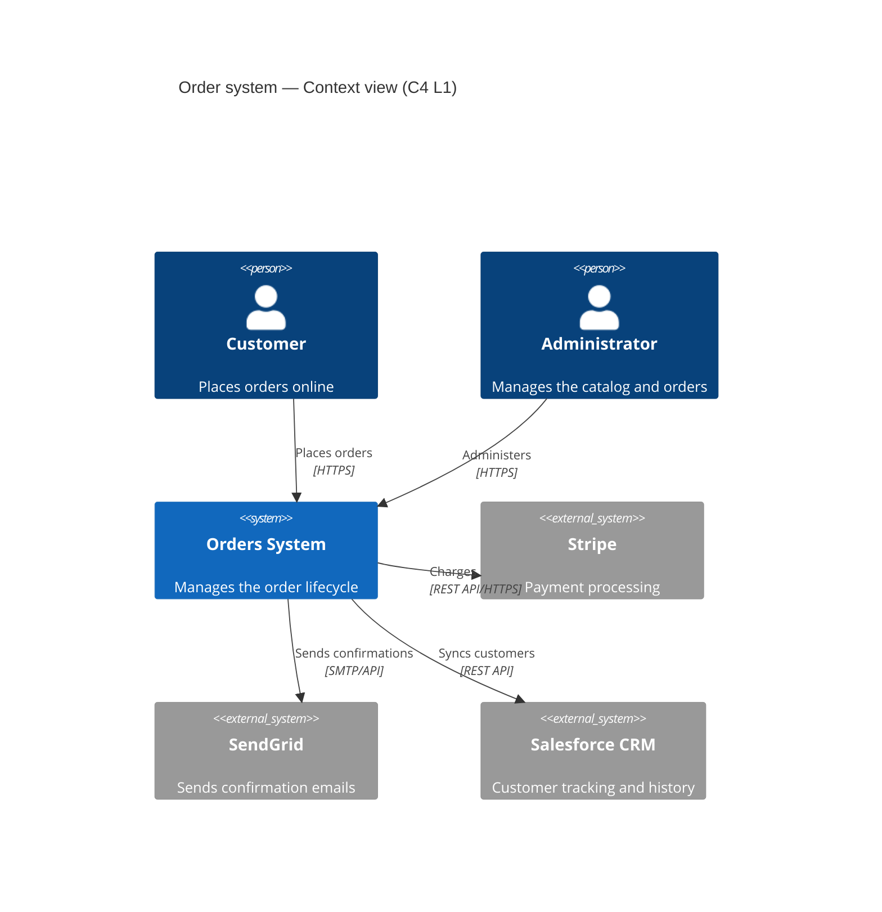
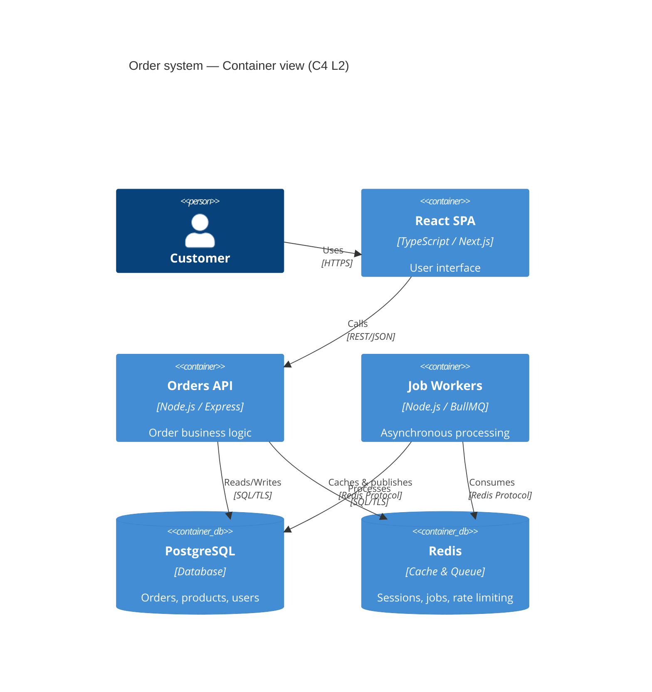

# Skill — Technical Documentation (ADR, C4, OpenAPI, Runbooks)
> Certifications: Postman API Fundamentals Expert · GitHub Certifications

## Objective
Produce clear, maintainable and useful technical documentation: Architecture Decision Records, C4 diagrams, OpenAPI specifications, operational runbooks — while avoiding over-documentation and staleness.

## Principles of good documentation

```
RULE                            WHY
──────────────────────────────  ──────────────────────────────────────────────────
Docs as Code                    Version in Git, reviewed like code (no orphan Wiki)
Just Enough Documentation       Document the WHY, not the WHAT (the code already says what)
Living Documentation            Generated from code where possible (OpenAPI, Storybook)
Audience first                  1 doc = 1 audience (Dev / Ops / Product / Stakeholder)
Date every decision             Undated ADRs turn into mysteries
```

## ADR — Architecture Decision Record

```markdown
# ADR-007 — Use PostgreSQL as the primary database

## Status
Accepted — 2026-05-26

## Context
We need to pick a database for the new Orders service.
Constraints: ACID transactions required, flexible JSON for metadata,
team familiar with SQL, limited SaaS budget.

## Options considered
1. **PostgreSQL** — SQL + JSONB, open source, excellent ecosystem
2. **MongoDB** — Schema flexibility, but limited transactions before v4
3. **DynamoDB** — Extreme scalability, but AWS vendor lock-in and unpredictable cost

## Decision
PostgreSQL with JSONB for flexible metadata.

## Consequences
✅ ACID transactions guaranteed for payments
✅ Team familiarity, fast onboarding
✅ JSONB for variable order attributes
⚠️ Horizontal scalability to watch beyond 10M rows (plan for sharding or Citus)
❌ More rigid than MongoDB for evolving schemas
```

## C4 diagrams — Mermaid





## Runbook — Incident template

```markdown
# Runbook — Orders API: performance degradation

## Symptoms
- P99 latency > 2s (Datadog alert)
- 504 errors on `/api/orders`
- BullMQ queue backing up

## Diagnosis

### Step 1 — Check the database
```bash
# Long-running queries
SELECT pid, query, now() - query_start AS duration, state
FROM pg_stat_activity
WHERE state != 'idle' AND query_start < now() - interval '5 seconds'
ORDER BY duration DESC;

# Missing indexes (sequential scans)
SELECT schemaname, tablename, seq_scan, idx_scan
FROM pg_stat_user_tables
WHERE seq_scan > idx_scan ORDER BY seq_scan DESC LIMIT 10;
```

### Step 2 — Check the Redis cache
```bash
redis-cli info stats | grep -E "instantaneous_ops|rejected_connections"
redis-cli info memory | grep used_memory_human
```

### Step 3 — Scale horizontally if needed
```bash
kubectl scale deployment orders-api --replicas=5
kubectl rollout status deployment/orders-api
```

## Rollback
```bash
kubectl rollout undo deployment/orders-api
```

## Escalation
- P0: Page oncall immediately (PagerDuty)
- P1: Notify the Tech Lead within 30 min
- Postmortem within 48h (template: docs/postmortem-template.md)
```

## Deliverables
- Documented ADRs (one file per decision)
- C4 diagrams levels 1 and 2 (Mermaid or Structurizr)
- Operational runbooks (one per critical service)
- Project technical glossary
- Developer onboarding README (local setup in < 15 min)

## Output format
Specify: **documentation type** (ADR, C4, runbook, API…), **audience** (junior dev, ops, product, stakeholder), **stack** and **existing architecture**, **urgency** (emergency doc vs full rework), **target format** (Markdown Git, Confluence, Notion).
