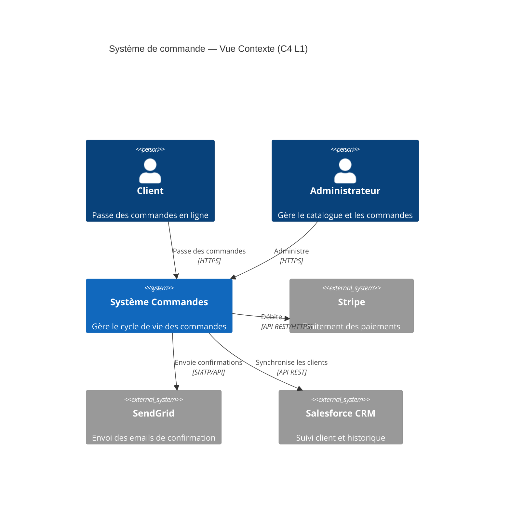
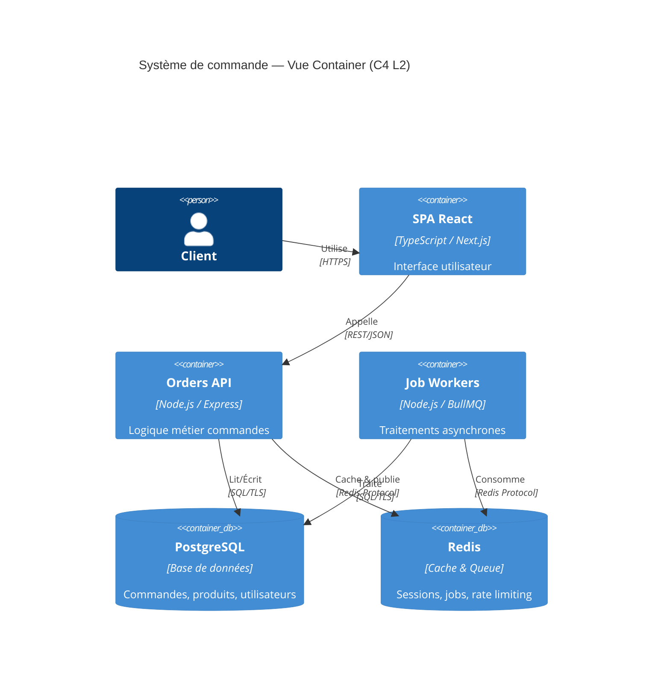

# Skill — Documentation Technique (ADR, C4, OpenAPI, Runbooks)
> Certifications : Postman API Fundamentals Expert · GitHub Certifications

## Objectif
Produire une documentation technique claire, maintenable et utile : Architecture Decision Records, diagrammes C4, spécifications OpenAPI, runbooks opérationnels — en évitant la sur-documentation et l'obsolescence.

## Principes de la bonne documentation

```
RÈGLE                           POURQUOI
──────────────────────────────  ──────────────────────────────────────────────────
Docs as Code                    Versionner dans Git, revu comme le code (pas de Wiki orphelin)
Just Enough Documentation       Documenter le POURQUOI, pas le QUOI (le code dit déjà quoi)
Living Documentation            Générée depuis le code quand possible (OpenAPI, Storybook)
Audience first                  1 doc = 1 audience (Dev / Ops / Product / Stakeholder)
Date every decision             Les ADR sans date deviennent des mystères
```

## ADR — Architecture Decision Record

```markdown
# ADR-007 — Utiliser PostgreSQL comme base de données principale

## Statut
Accepté — 2026-05-26

## Contexte
Nous devons choisir une base de données pour le nouveau service Orders.
Contraintes : transactions ACID requises, JSON flexible pour les métadonnées,
équipe familière SQL, budget SaaS limité.

## Options considérées
1. **PostgreSQL** — SQL + JSONB, open source, excellent écosystème
2. **MongoDB** — Flexibilité schema, mais transactions limitées avant v4
3. **DynamoDB** — Scalabilité extrême, mais vendor lock-in AWS et coût imprévisible

## Décision
PostgreSQL avec JSONB pour les métadonnées flexibles.

## Conséquences
✅ Transactions ACID garanties pour les paiements
✅ Familiarité équipe, onboarding rapide
✅ JSONB pour les attributs variables de commande
⚠️ Scalabilité horizontale à surveiller au-delà de 10M lignes (prévoir sharding ou Citus)
❌ Plus rigide que MongoDB pour les schémas évolutifs
```

## Diagrammes C4 — Mermaid





## Runbook — Template Incident

```markdown
# Runbook — Orders API : dégradation des performances

## Symptômes
- Latence P99 > 2s (alerte Datadog)
- Erreurs 504 sur `/api/orders`
- Queue BullMQ en accumulation

## Diagnostic

### Étape 1 — Vérifier la base de données
```bash
# Requêtes longues en cours
SELECT pid, query, now() - query_start AS duration, state
FROM pg_stat_activity
WHERE state != 'idle' AND query_start < now() - interval '5 seconds'
ORDER BY duration DESC;

# Index manquants (sequential scans)
SELECT schemaname, tablename, seq_scan, idx_scan
FROM pg_stat_user_tables
WHERE seq_scan > idx_scan ORDER BY seq_scan DESC LIMIT 10;
```

### Étape 2 — Vérifier le cache Redis
```bash
redis-cli info stats | grep -E "instantaneous_ops|rejected_connections"
redis-cli info memory | grep used_memory_human
```

### Étape 3 — Scaler horizontalement si nécessaire
```bash
kubectl scale deployment orders-api --replicas=5
kubectl rollout status deployment/orders-api
```

## Rollback
```bash
kubectl rollout undo deployment/orders-api
```

## Escalade
- P0 : Page oncall immédiatement (PagerDuty)
- P1 : Prévenir le Tech Lead dans les 30 min
- Postmortem dans les 48h (template : docs/postmortem-template.md)
```

## Livrables
- ADR documentés (un fichier par décision)
- Diagrammes C4 niveaux 1 et 2 (Mermaid ou Structurizr)
- Runbooks opérationnels (un par service critique)
- Glossaire technique du projet
- README d'onboarding développeur (setup local en < 15 min)

## Format de sortie
Précise : **type de documentation** (ADR, C4, runbook, API…), **audience** (dev junior, ops, product, stakeholder), **stack** et **architecture existante**, **urgence** (doc d'urgence vs refonte complète), **format cible** (Markdown Git, Confluence, Notion).
